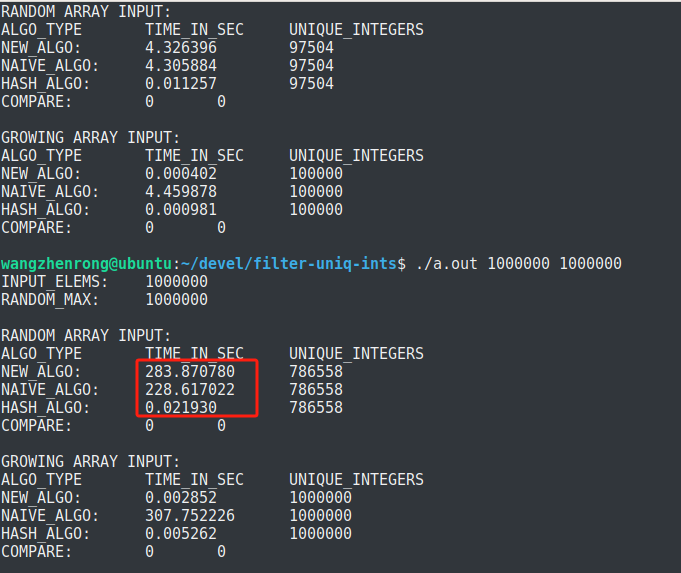

# Filter-Uniq-Ints: A small practice to filter out unique integers from an integer array

# 1. Background

## 1.1 Problem description

This program aims to solving a classic question: eliminate the duplicate elements from an unsorted integer array. For example:

For an original array with 9 elements: {16, 17, 2, *17*, 4, *2*, 97, *4*, *17*}

The program should process it to {16, 17, 2, 4, 97} with 5 unique elements, and the duplicate elements (in this case, are *17*, *4*, *2*) are skipped.

## 1.2 Algorithms

For a given integer array **int_arr_input[ NUM_ELEMS ]**, there are several algorithms to solve this problem.

### 1.2.1 Brute (Naive) Algorithm

One can use a 2-layer loop algorithm:

- An outer loop to scan the input integer array **int_arr_input[ NUM_ELEMS ]**.
- An inter loop to check whether the current elem is duplicate or not. 

```
j = 0; /* The index for output array. */
for (i = 0; i < NUM_ELEMS; i++) {
    tmp_elem = input_arr_input[i];
    for (k = 0; k < j; k++) {
        if(int_arr_output[k] == tmp_elem) {
            break; /* If duplication found, break the loop */
        }
    }
    if( k == j) {
        /* If no duplication found, store the integer to the output array */
        int_arr_output[j] = tmp_elem;
        j++;
    }
}
```

It is clear, this algorithm would be very slow when the input integer array is very large.

### 1.2.2 Improved Brute Algorithm

The brute algorithm can be improved. One can record the current `maximum`, `minimum`, `diff-to-maximum`, `diff-to-minimum` of the **int_arr_output[ NUM_ELEMS_OUTPUT ]**, the next element of **int_arr_input** (**tmp_elem**) can be compared with these 4 values before the brute comparison:

```
tmp_elem = input_arr[i];
tmp_diff_to_max = max_current - tmp_elem;
tmp_diff_to_min = tmp_elem - min_current;
```

If `tmp_diff_to_max == 0` OR `tmp_diff_to_min == 0` OR `tmp_diff_to_max == prev_diff_to_max` OR `tmp_diff_to_min == prev_diff_to_min`, the `tmp_elem` is duplicate, skip it and go to the next `input_arr[i]`

If `tmp_diff_to_max < 0` OR `tmp_diff_to_min < 0`, meaning that the `tmp_elem` is out of the previous range and it must be NOT duplicate. Store it, update `maximum`, `minimum`, `diff-to-maximum`, `diff-to-minimum` because the range has been expanded by `tmp_elem`, and go to the next `input_arr[i]`.

If `tmp_diff_to_min < diff_to_min` OR `tmp_diff_to_max < diff_to_max`, meaning that the `tmp_elem` is not duplicate because it is closer to the `maximum` or `minimum` than the previously stored elements. Store it, update `diff-to-maximum`, `diff-to-minimum`, and go to the next `input_arr[i]`.

All other cases should go to the brute comparison loop, that is:

```
j = 0; /* The index for output array. */
for (i = 0; i < NUM_ELEMS; i++) {
    tmp_elem = input_arr_input[i];
    ...
    /* handling the conditions described above. */
    ...
    for (k = 0; k < j; k++) {
        if(int_arr_output[k] == tmp_elem) {
            break; /* If duplication found, break the loop */
        }
    }
    if( k == j) {
        /* If no duplication found, store the integer to the output array */
        int_arr_output[j] = tmp_elem;
        j++;
    }
}
```

This method is super quick for sorted array because it skipped all the inner loop. For input arrays with randomly-generated integers, this method doesn't help much.

### 1.2.3 Hash Table Algorithm

To eleminate the inner loop completely, we can use hash table to record the occurance of elements. By using a division and mod operation to a constant M, Every previously stored integer N can be expressed by 2 integers: 

`(a = N / M, b = N Mod M )`

So, the task of the inner loop (check duplication of `tmp_elem`) can be done by storing and checking the `a` `b`. And the inner loop can be eleminated completely.

I propose a simple data structure using 2 pointer arrays: one for the positive elements (`int *hash_table_base_p[]`), one for the negative elements (`int *hash_table_base_n[]`).

Given the range of signed int (usially is 32-bit) has a range of [ -2^31 , 2^31 ], we can use 65536 (2^16) as the constant M to divide and mod. The quotient would be in [ 0, 32768 ], and the mod would be [ -65535, 65535 ]. So, we can define the size of `hash_table_base_p[]` and `hash_table_base_n[]` to 32769. Let's check the `hash_table_base_p[]` because `hash_table_base_n[]` is the designed with the same logic.

For `hash_table_base_p[i]`, the initial value is NULL. If `( (a = N / M) == i )`, a mod array with size 65536 would be allocated to store the mod value `b = N Mod M`. 

For example if `tmp_elem = 65537` and **it is NOT duplicate**, that is, `a = tmp_elem / 65536 = 1`, `b = tmp_elem % 65536 = 1`, the `hash_table_base_p[1]` would point to an allocated `mod_array[65536]`, and `mod_array[1]` would be set to 1.

To check whether `tmp_elem` is duplicate or not, it is quite simple, the psudo code:

```
If tmp_elem > 0 {
    a = tmp_elem / 65536
    b = tmp_elem % 65536
    if (hash_table_base_p[a] != NULL) AND ((hash_table_base_p[a])[b] == 1) {
        duplicate
    }
    else {
        unique
    }
} else {
    ...
}
```

Obviously, this algorithm is able to improve and guarantee the performance especially when the **int_arr_input[ NUM_ELEMS ]** is big.

## 1.3 Preliminery Benchmark

The preliminery benchmark suppports the analysis of the algorithms above. See the screenshot below.



The HASH algorithm is 10000x faster than the other 2 algorithms.

# 2. Brief Intro

**Program Name**: Filter-Uniq-Ints

**Purpose**: filter out unique integers from an **unsorted** integer array. E.g. {1,2,1,3} should be filtered to {1,2,3}

**License**: MIT

# 3. How-To: Build, Run, and Use

## 3.1 Build

### 3.1.1 Prerequisites

You need a C compiler to build. 

- For Microsoft Windows users, [mingw-w64](https://sourceforge.net/projects/mingw-w64/) is recommended
- For GNU/Linux Distro or other *nix users, the [GNU Compiler Collections](https://gcc.gnu.org/), known as gcc, is a perfect one
- For macOS users, [clang](https://clang.llvm.org/) is easy to install and use (brew is not needed to install clang on macOS).

### 3.1.2 Build Guide

1. Use git to clone this code: `git clone https://github.com/zhenrong-wang/filter-uniq-ints.git`
2. Change your directory: `cd filter-uniq-ints`
3. Build command example: `gcc filter_uniq_ints.c -o my_program_name -Wall -Ofast`

## 3.2 Run

Command Format: `cmd argv[1] argv[2]`

- `argv[1]`: A string to specify an integer as the number of elems input. E.g. 10032 
- `argv[2]`: A string to specify an integer as the maximum random number generated. E.g. 1000

# 4 Bugs and Communications

Any bugs or problems found, please submit issues to this repo. I'd be glad to communicate on any issues.

Or, you can also email me: zhenrongwang@live.com
